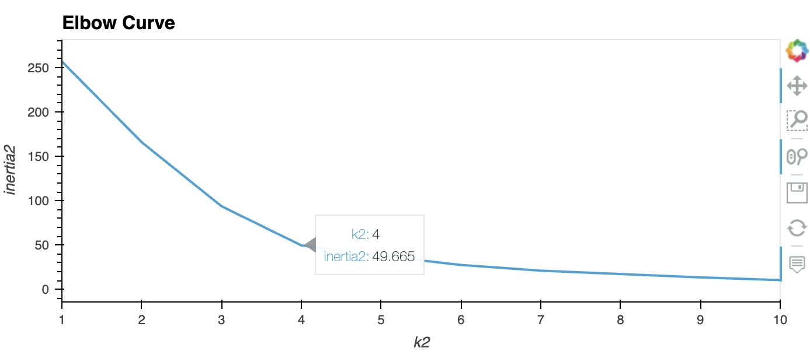

# CryptoClustering
Used python and unsupervised learning methods which are K-Means and PCA to cluster and predict if cryptocurrencies are affected by 24-hour or 7-day price changes.

#### In this project the following tasks have been accomplished:

 - Loaded the data in the csv file into a dataframe.
 - Got the summary statistics and plotted the data to see what the data looks like before proceeding.

  

- Used the StandardScaler() module from scikit-learn to normalize the data from the CSV file.
- Created a DataFrame with the scaled data and set the "coin_id" index from the original DataFrame as the index for the new DataFrame.
- Used the elbow method to find the best value for k.

  

- clustered the cryptocurrencies for the best value for k on the original scaled data and created a scatter plot using hvPlot.
- Added the "coin_id" column in the hover_cols parameter to identify the cryptocurrency represented by each data point.

  

- Using the original scaled DataFrame, i performed a PCA and reduced the features to three principal components.
- Retrieved the explained variance to determine how much information can be attributed to each principal component

  

- Created a new DataFrame with the PCA data and set the "coin_id" index from the original DataFrame as the index for the new DataFrame.
- Used the elbow method on the PCA data to find the best value for k.

  

- Clustered the cryptocurrencies for the best value for k on the PCA data and created a scatter plot using hvPlot.
- Added the "coin_id" column in the hover_cols parameter to identify the cryptocurrency represented by each data point.

  

#### Conclusion: 

After visually analyzing the cluster analysis results, the use of PCA to cluster the data using K-Means has resulted in less dispersed data points, which means, tighter clusters, reduced ambiguity, and better interpretation.